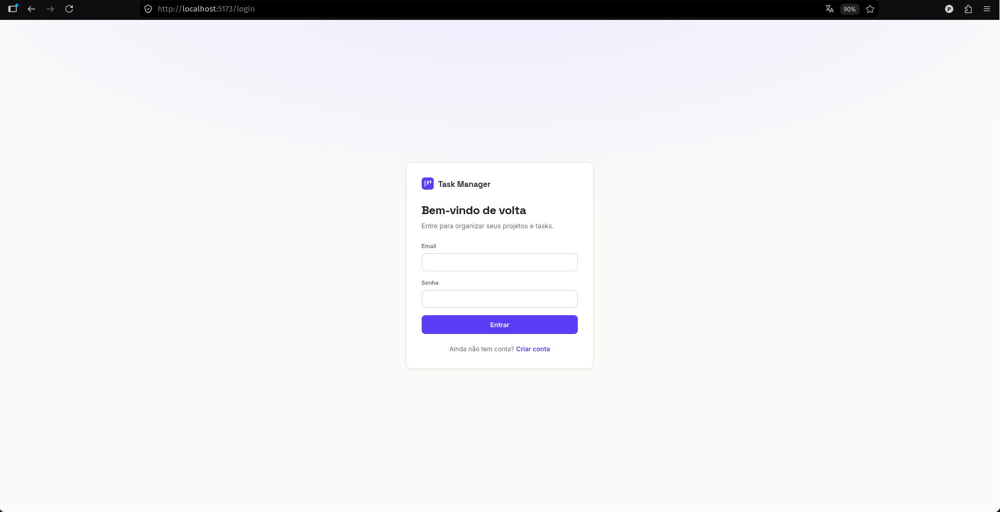
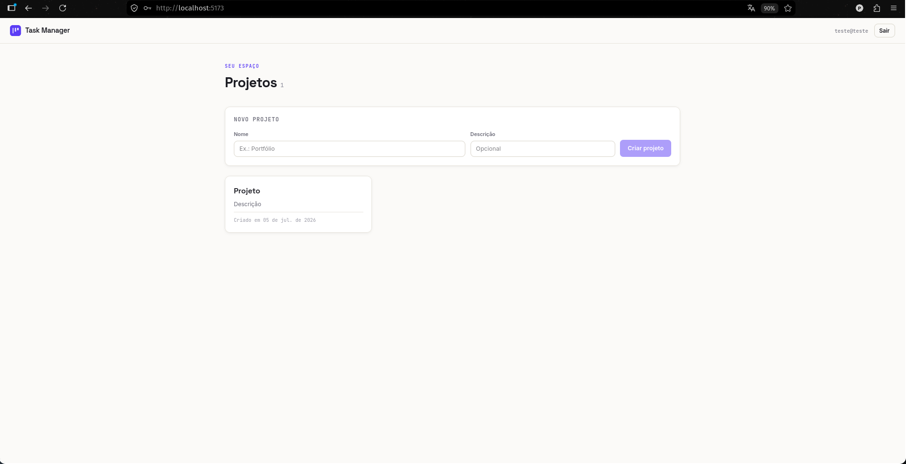
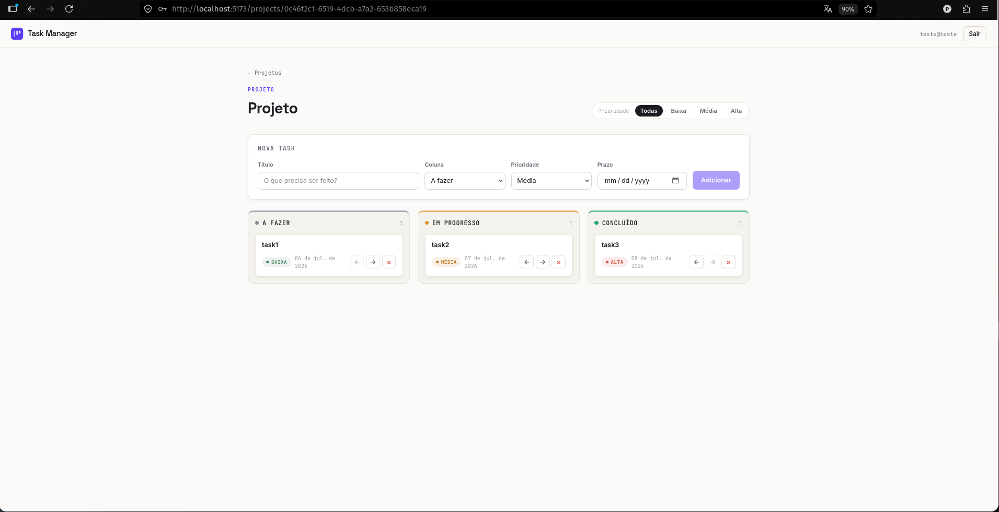

# Task Manager API

[](https://github.com/pehenriqueoliv/TaskManager/actions/workflows/ci.yml)

API de gerenciamento de tarefas construída como projeto de portfólio para demonstrar
domínio de **.NET idiomático**. Um usuário organiza **projetos**, e cada projeto tem
suas **tarefas** (com status, prioridade e prazo).

> Projeto em construção por fases. Esta é a documentação acumulada; cada fase amplia o escopo.

## Telas

**Login**



**Projetos**



**Dentro de um projeto**



## Stack

- **Back-end:** ASP.NET Core Web API — C#, .NET 10 (LTS)
- **Persistência:** Entity Framework Core + PostgreSQL (provider Npgsql)
- **Documentação/testes manuais:** Swagger (Swashbuckle)
- **Autenticação:** ASP.NET Core Identity + JWT (access + refresh token)
- **Front-end:** React + TypeScript com Vite, TanStack Query (React Query), axios e React Router

## Estrutura do monorepo

```
TaskManager/
├── backend/
│   ├── TaskManager.slnx
│   ├── Dockerfile           imagem da API (.NET, multi-stage)
│   ├── src/TaskManager.Api/
│   │   ├── Controllers/     endpoints HTTP (camada fina)
│   │   ├── Services/        regras de negócio
│   │   ├── Data/            AppDbContext
│   │   ├── Entities/        entidades de domínio (Project, TaskItem, enums)
│   │   ├── Dtos/            records de request/response
│   │   ├── Common/          exceções de domínio, handler global, JWT, ICurrentUser
│   │   └── Migrations/      migrations do EF Core
│   └── tests/TaskManager.Tests/   testes de unidade dos Services (xUnit + Moq)
├── frontend/                app React + TypeScript (Vite)
│   └── src/
│       ├── api/             cliente axios (Bearer + refresh) e chamadas
│       ├── auth/            AuthContext (token + sessão)
│       ├── hooks/           queries e mutations (React Query)
│       ├── components/      Board, TaskCard, formulários, estados
│       └── pages/           Login, Projetos, Detalhe do projeto
├── docker-compose.yml       PostgreSQL + API (containerizada)
└── README.md
```

## Pré-requisitos

- [Docker](https://www.docker.com/) — obrigatório para o PostgreSQL (e, opcionalmente, para a API)
- Para rodar o back-end localmente (hot reload): [.NET SDK 10](https://dotnet.microsoft.com/) e a CLI do EF Core:
  ```bash
  dotnet tool install --global dotnet-ef
  ```

## Rodar com Docker (API + banco)

O caminho mais rápido: sobe **PostgreSQL + API** com um comando, sem precisar do .NET
instalado. Da raiz do repositório:

```bash
docker compose up -d --build
```

- API: `http://localhost:5023` · Swagger: `http://localhost:5023/swagger`
- A API espera o banco ficar saudável (`depends_on` + healthcheck) e aplica as migrations no startup.
- A chave do JWT vem da variável `JWT_KEY` (há um valor padrão só para dev). Para usar a sua,
  crie um `.env` na raiz do repositório:
  ```bash
  echo "JWT_KEY=$(head -c 48 /dev/urandom | base64)" > .env
  ```
- Para parar: `docker compose down` (use `-v` para apagar também o volume do banco).

O front-end continua rodando à parte (veja a seção **Front-end**).

## Rodar o back-end localmente (hot reload)

Alternativa para desenvolver a API com `dotnet run`.

### 1. Subir apenas o banco

```bash
docker compose up -d postgres
```

Isso sobe um PostgreSQL na porta **5433** do host (mapeada para a 5432 do container,
para não conflitar com um Postgres eventualmente já rodando na 5432).

### 2. Configurar a connection string (User Secrets)

A connection string é lida da configuração pela chave `ConnectionStrings:DefaultConnection`.
Em desenvolvimento ela fica nos **User Secrets** (fora do controle de versão):

```bash
cd backend
dotnet user-secrets set "ConnectionStrings:DefaultConnection" \
  "Host=localhost;Port=5433;Database=taskmanager;Username=taskmanager;Password=taskmanager" \
  --project src/TaskManager.Api
```

### 2b. Configurar a chave do JWT (User Secrets)

A chave de assinatura do JWT (`Jwt:Key`) também é sensível e fica nos User Secrets.
Gere uma chave forte (mínimo 256 bits) e grave:

```bash
cd backend
dotnet user-secrets set "Jwt:Key" "$(head -c 48 /dev/urandom | base64)" \
  --project src/TaskManager.Api
```

Os demais parâmetros do JWT (`Issuer`, `Audience`, tempos de expiração) ficam no
`appsettings.json`, por não serem sensíveis.

### 3. Aplicar as migrations

Em ambiente de desenvolvimento a API aplica as migrations pendentes automaticamente no
startup. Se quiser aplicar manualmente:

```bash
cd backend
dotnet ef database update --project src/TaskManager.Api
```

### 4. Rodar a API

```bash
cd backend
dotnet run --project src/TaskManager.Api --launch-profile http
```

- API: `http://localhost:5023`
- Swagger UI: `http://localhost:5023/swagger`

## Autenticação

Todos os endpoints de `projects` e `tasks` são **protegidos por JWT**. O fluxo:

1. `POST /api/auth/register` ou `POST /api/auth/login` → devolve um **access token**
   (JWT de curta duração) e um **refresh token** (opaco, de longa duração).
2. Envie o access token no header `Authorization: Bearer <token>` nas chamadas protegidas.
3. Quando o access token expirar, use `POST /api/auth/refresh` com o refresh token para
   obter um novo par. O refresh token é **rotacionado**: o antigo é invalidado a cada uso.

Cada usuário só enxerga e manipula os próprios projetos e tasks; acessar recurso de outro
usuário retorna **404** (não vaza a existência do recurso).

### Testar endpoints protegidos no Swagger

Faça `register`/`login` pelo próprio Swagger, copie o `accessToken` da resposta, clique no
botão **Authorize** (cadeado) no topo, cole só o token e confirme. As chamadas seguintes já
irão autenticadas.

### Auth

| Método | Rota                   | Descrição                                   |
|--------|------------------------|---------------------------------------------|
| POST   | `/api/auth/register`   | Cria um usuário e devolve access + refresh  |
| POST   | `/api/auth/login`      | Autentica e devolve access + refresh        |
| POST   | `/api/auth/refresh`    | Troca o refresh token por um novo par       |

## Endpoints protegidos

### Projects

| Método | Rota                  | Descrição                    |
|--------|-----------------------|------------------------------|
| POST   | `/api/projects`       | Cria um projeto              |
| GET    | `/api/projects`       | Lista os projetos            |
| GET    | `/api/projects/{id}`  | Detalha um projeto           |
| DELETE | `/api/projects/{id}`  | Remove um projeto (cascade)  |

### Tasks (escopadas ao projeto)

| Método | Rota                                       | Descrição                              |
|--------|--------------------------------------------|----------------------------------------|
| POST   | `/api/projects/{projectId}/tasks`          | Cria uma task no projeto               |
| GET    | `/api/projects/{projectId}/tasks`          | Lista as tasks (filtros opcionais)     |
| PUT    | `/api/projects/{projectId}/tasks/{id}`     | Atualiza uma task                      |
| DELETE | `/api/projects/{projectId}/tasks/{id}`     | Remove uma task                        |

Filtros opcionais no GET de tasks via query string:
`?status=Todo|InProgress|Done` e `?priority=Low|Medium|High`.

## Regras de negócio já implementadas

- Apenas usuários autenticados acessam os endpoints de `projects`/`tasks` (**JWT**).
- Cada usuário só acessa os próprios projetos e tasks (recurso de outro dono → **404**).
- Deletar um projeto apaga suas tasks em **cascade** (garantido pela FK no banco).
- `DueDate` no passado na criação de uma task é rejeitado com **400**.
- Erros seguem o formato **Problem Details (RFC 7807)**.

## Testes

Testes de unidade dos Services com **xUnit** e **Moq**:

```bash
cd backend
dotnet test
```

Estratégia:

- **`ProjectService` / `TaskService`** são testados contra um **SQLite in-memory** (banco
  relacional real), não com um `DbContext` mockado. Isso permite testar de verdade o
  **cascade delete** e o escopo por usuário, exercitando o SQL gerado. Mockar `DbContext`
  é frágil e não fiel, por isso não é usado aqui.
- **`AuthService`** é testado com **Moq** nos colaboradores (`UserManager`, `ITokenService`),
  cobrindo rotação de refresh token e falhas de autenticação.
- **`TokenService`** é testado diretamente (hash determinístico, unicidade dos tokens).

Casos cobertos incluem: acesso a recurso de outro usuário (**404**), `DueDate` no passado
(**400**), cascade delete, filtros de task e o fluxo de register/login/refresh.

## Front-end

App em React + TypeScript (Vite) que consome a API.

### Rodar

Com a API no ar (porta 5023), em outro terminal:

```bash
cd frontend
npm install
npm run dev
```

Abre em `http://localhost:5173`. A URL da API vem de `VITE_API_BASE_URL`
(`frontend/.env.development`, padrão `http://localhost:5023/api`).

### O que tem

- **Login / cadastro** numa única tela; o par de tokens é guardado no `localStorage`.
- **Refresh automático:** um interceptor do axios injeta o `Bearer` e, ao receber **401**,
  troca o refresh token por um novo par e repete a requisição (com _single-flight_ para não
  disparar vários refreshes em paralelo). Se o refresh falhar, a sessão é encerrada.
- **Rotas protegidas:** sem sessão, redireciona para o login.
- **Projetos:** criar, listar e excluir (excluir apaga as tasks em cascade no back-end).
- **Board de tasks** (colunas Todo / Em progresso / Concluído): criar, mover entre colunas
  (via `PUT`), excluir e filtrar por prioridade (via query na API).
- **Estado das chamadas com React Query:** cache, `isLoading`/`isError` e invalidação
  automática após cada mutation.

## Roadmap

- **Fase 1 ✓:** scaffold, EF Core + PostgreSQL, entidades, migrations, CRUD de Project e Task.
- **Fase 2 ✓:** ASP.NET Core Identity + JWT (access + refresh), proteção dos endpoints e escopo por usuário.
- **Fase 3 ✓:** testes com xUnit + Moq nos Services.
- **Fase 4 ✓:** front-end React + TypeScript (Vite + React Query).
- **Extra ✓:** Dockerfile multi-stage da API e `docker compose` subindo API + banco juntos.
